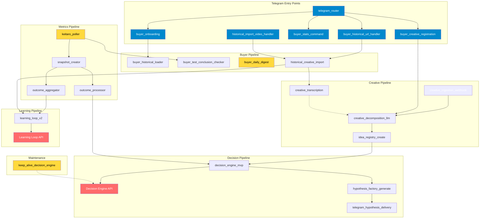
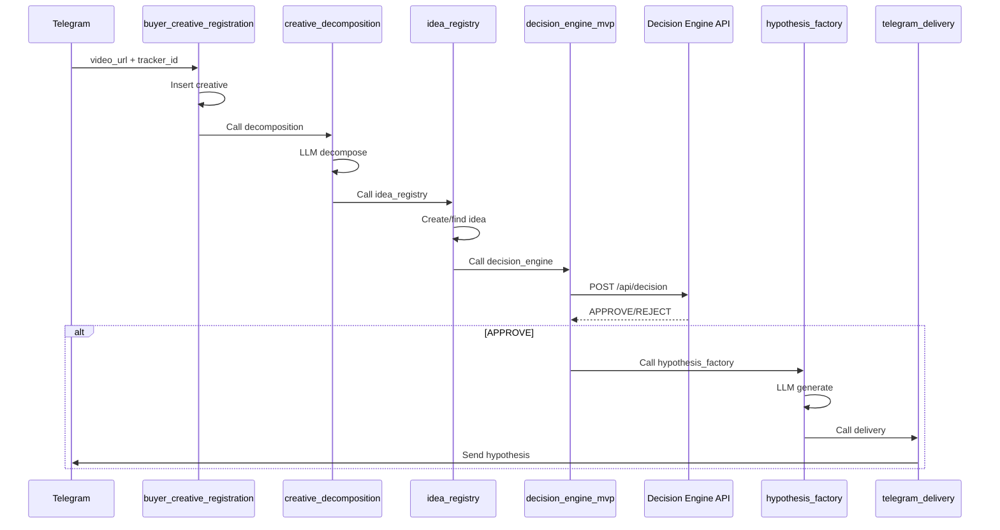
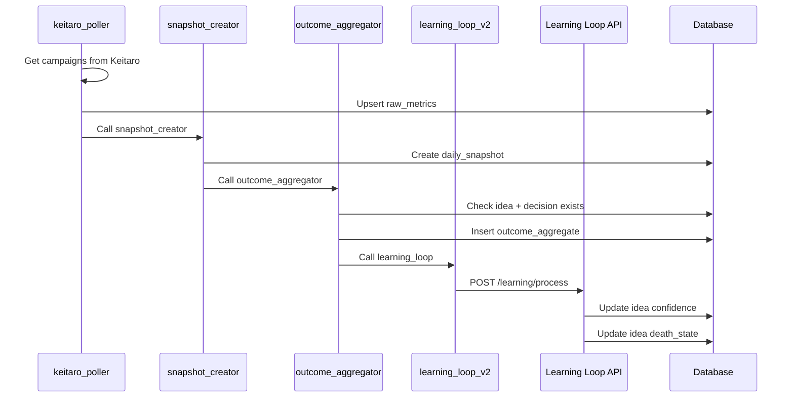
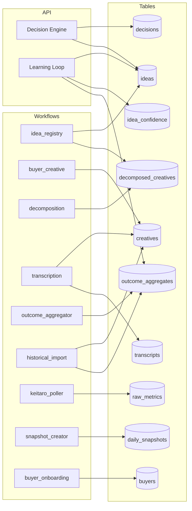
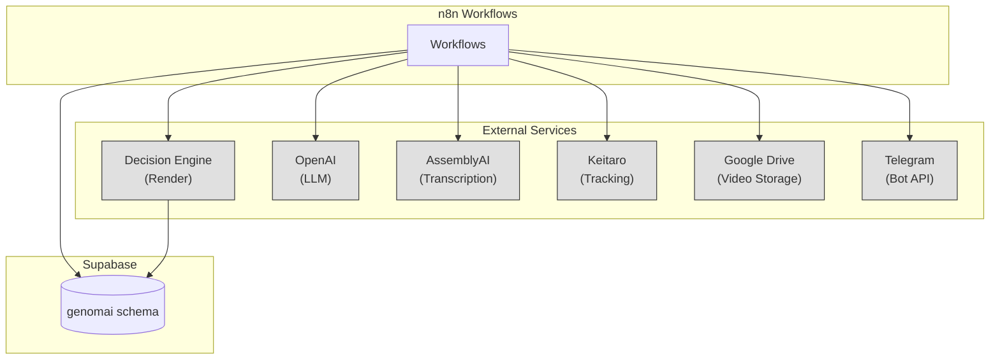

# Dependency Graph

Визуализация зависимостей между workflows, API и таблицами БД.

**Auto-generated from:** `infrastructure/schemas/dependency_manifest.json`
**Last updated:** 2025-12-26

---

## Workflow Call Graph



---

## Critical Chains

### 1. Creative → Hypothesis Chain



### 2. Metrics → Learning Chain



---

## Table Dependencies

### Writers by Table



### Read/Write Matrix

| Table | Writers | Readers |
|-------|---------|---------|
| `ideas` | idea_registry, DE API, LL API | decision_engine, outcome_aggregator, hypothesis_factory |
| `creatives` | buyer_creative, transcription, historical_import | decomposition, transcription, test_checker |
| `decisions` | DE API | outcome_aggregator, hypothesis_factory |
| `outcome_aggregates` | outcome_aggregator, historical_import, LL API | LL API |
| `raw_metrics` | keitaro_poller | snapshot_creator, test_checker, daily_digest |
| `daily_metrics_snapshot` | snapshot_creator | outcome_aggregator |
| `idea_confidence_versions` | LL API | LL API |
| `buyers` | buyer_onboarding | all buyer workflows |

---

## External Dependencies



---

## Impact Analysis

### If you change...

| Component | Immediate Impact | Cascade Impact |
|-----------|-----------------|----------------|
| `idea_registry_create` | ideas table | decision_engine, hypothesis_factory, learning_loop |
| `decision_engine_mvp` | decisions table | hypothesis_factory, outcome_processor |
| `keitaro_poller` | raw_metrics | snapshot_creator → outcome_aggregator → learning_loop |
| `learning_loop_v2` | idea confidence, death_state | All future decisions for affected ideas |
| Decision Engine API | decisions, traces | All workflows calling /api/decision |
| Learning Loop API | ideas, confidence | Future decisions (death_state check) |

### Danger Zones

```
⚠️  HIGH RISK CHANGES:
├─ ideas.death_state → affects all future decisions
├─ outcome_aggregates.learning_applied → learning loop idempotency
├─ decomposed_creatives.idea_id → learning loop resolution
└─ decisions.decision_id → outcome_aggregates linkage
```

---

## Regenerating This Graph

```bash
# From dependency manifest
python scripts/sync_dependencies.py

# Validates manifest and generates Mermaid
```

See: `infrastructure/schemas/dependency_manifest.json` for source data.
