# Dependency Graph

Визуализация зависимостей между workflows, API и таблицами БД.

**Auto-generated from:** n8n API
**Last updated:** 2025-12-28 01:46

---

## Workflow Call Graph

```mermaid
flowchart TD

    %% Auto-generated from n8n workflows
    %% Updated: 2025-12-28 01:46

    subgraph Telegram["Telegram Entry Points"]
        buyerhistorical[buyer_historical_url_handler]
        telegramrouter[telegram_router]
        telegramcreativ[telegram_creative_ingestion]
        historicalimpor[historical_import_video_handler]
        buyercreativere[buyer_creative_registration]
        buyeronboarding[buyer_onboarding]
        buyerstatscomma[buyer_stats_command]
    end

    subgraph Scheduled["Scheduled Jobs"]
        keitaropoller[keitaro_poller]
        performancemetr[performance_metrics_collector]
        keepalivedecisi[keep_alive_decision_engine]
        buyerdailydiges[buyer_daily_digest]
        dailyrecommenda[daily_recommendation_generator]
        outcomeingestio[outcome_ingestion_keitaro]
    end

    %% Workflow calls
    keitaropoller --> buyer
    keitaropoller --> snapshotcreator
    historicalcreat --> creativetranscr
    historicalcreat --> learningloop
    buyerhistorical --> historicalimpor
    zalivsessionhan --> creativetranscr
    creativereplyha --> creativetranscr
    buyerhistorical --> historicalimpor
    telegramrouter --> router
    snapshotcreator --> outcomeaggregat
    snapshotcreator --> outcomeprocesso
    telegramcreativ --> ingest
    historicalimpor --> historicalimpor
    idearegistrycre --> 8a0b9e75a8eb449
    buyercreativere --> decompose
    creativeingesti --> a1b2c3d4e5f6789
    buyeronboarding --> buyerhistorical
    creativedecompo --> idearegistrycre
    spycreativeregi --> creativetranscr
    spycreativeregi --> decompose
    dailyrecommenda --> recommendationd
```

---

See `infrastructure/schemas/dependency_manifest.json` for full details.
